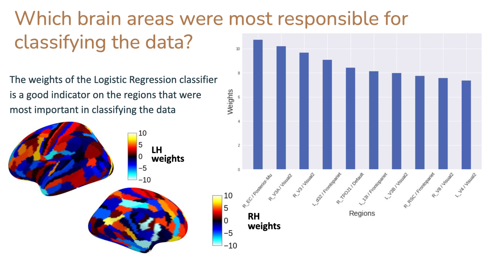
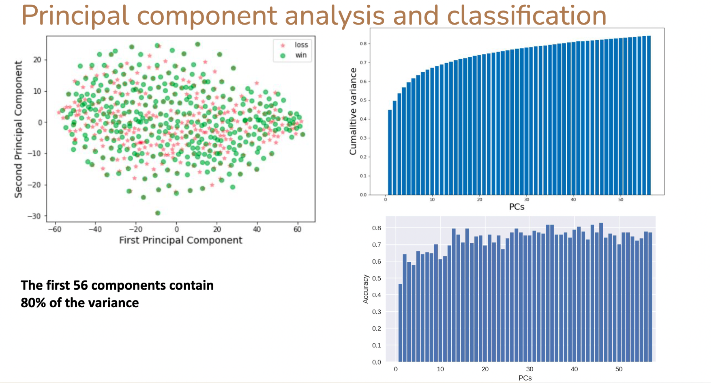

# Studying Neurological Differences Between Winning and Losing a Gamble
[](https://opensource.org/licenses/MIT)

Taha Binhuraib, Sebastiano Vacca, Mohaned Bador


## Installation and Setup
### Git Clone
Git clone the repository by running the following commands:
```bash
# change directory to Documents
cd Documents
git clone https://github.com/TahaBinhuraib/NWA_project.git
cd NWA_project
```
### Anaconda
You need to install [Anaconda](https://www.anaconda.com/products/distribution), then run below:
```bash
conda create --name nwa python=3.8
conda activate nwa
pip install -r requirements.txt
```
## Usage
### Jupyter Notebooks
* [Visualizations](/analyses/visualization.ipynb)
* [Generalized Linear Models on fMRI Data](/analyses/GLMfmri.ipynb)
* [PCC](/analyses/PCC.ipynb)
* [Binary Classification with Beta Coefficients](/analyses/ClassificationBetasAverage.ipynb)
* [PyTorch Binary Classification](/analyses/BinaryPredictionPyTorch)
  
## Results



